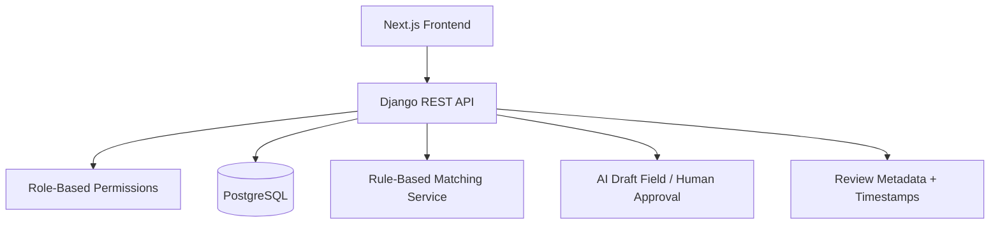
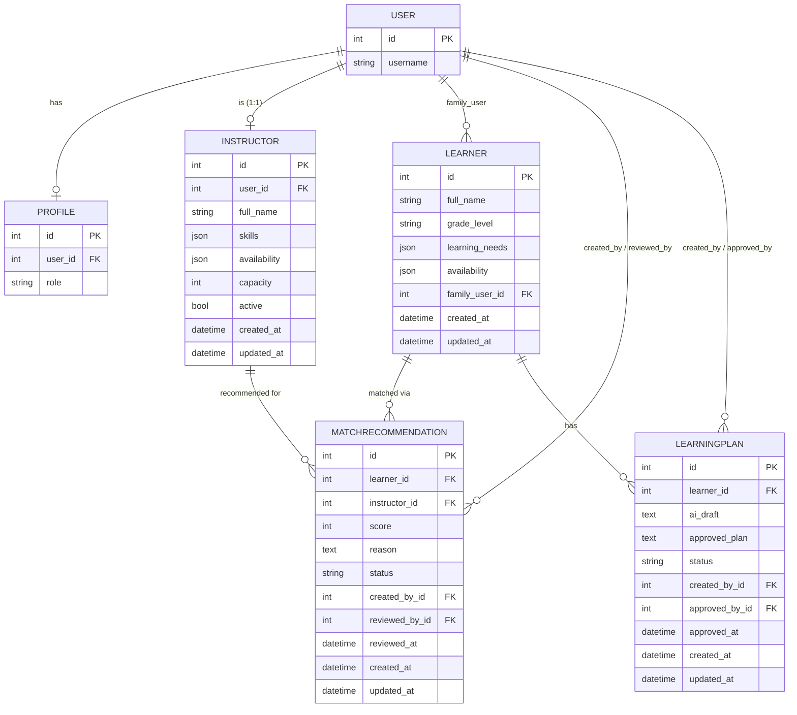

# PEAK-Lite Backend v2

A small, interview-ready Django REST Framework + PostgreSQL backend for **PEAK**, a nonprofit platform that matches learners with instructors and produces AI-drafted, human-approved learning plans.

This is a compact demonstration project, not a production system. It's built to be read end-to-end in a few minutes and explained clearly in an interview.

## 1. Project overview

PEAK-Lite Backend v2 models the core workflow behind PEAK:

1. A **case manager** or **admin** requests instructor matches for a **learner**.
2. The API runs simple, explainable rule-based matching and returns scored **match recommendations**.
3. A case manager/admin reviews and approves a match.
4. An AI service (simulated here) drafts a **learning plan** for the learner.
5. A human (case manager or admin) reviews the draft and either approves it — producing an `approved_plan` — or rejects it. The draft is never shown to a family as final without that step.

Everything is gated by **role-based permissions**: admin, case manager, instructor, and family each see and do different things.

## 2. Why this matters

PEAK serves children and neurodivergent learners. In that context, an AI system that silently decides who a child is matched with, or what their support plan says, is a liability — not a feature. This backend bakes in a hard rule at the data-model level: `LearningPlan.ai_draft` and `LearningPlan.approved_plan` are separate fields, and `approved_plan` can only be set by an admin or case manager through an explicit `/approve/` action that stamps `approved_by` and `approved_at`. AI assists; a human decides. That's the single design decision this whole project is built around.

## 3. Architecture



- **Auth**: Django's built-in `User` model + a lightweight `Profile` model carrying a `role` field (`admin`, `case_manager`, `instructor`, `family`). Token authentication (`rest_framework.authtoken`) so a frontend can log in once and attach `Authorization: Token <token>` to subsequent requests.
- **Matching**: `core/matching.py` — pure functions, no framework dependencies, easy to unit test.
- **AI draft**: `core/ai.py` — a stand-in for a real LLM call. Swapping it for an actual model call wouldn't change the approval workflow at all, because the workflow lives in the model/permissions layer, not in the AI call.
- **Audit**: every approval records who approved it and when (`reviewed_by`/`reviewed_at` on `MatchRecommendation`, `approved_by`/`approved_at` on `LearningPlan`).

## 4. Database schema



## 5. Roles and permissions

| Role | Can do |
|---|---|
| **admin** | Everything |
| **case_manager** | Create match recommendations, approve/reject match recommendations and learning plans, manage learners/instructors |
| **instructor** | View only the match recommendations (and related learners) assigned to them |
| **family** | View only their own learner's data (learner profile, match recommendations, learning plans) |

Enforced in `core/permissions.py` (`IsAdminOrCaseManager` gates create/approve/reject) and per-viewset `get_queryset()` filtering (row-level visibility). No role except admin/case_manager can call `/approve/` on a learning plan.

## 6. API examples

### Log in

```bash
curl -X POST http://localhost:8000/api/auth/login/ \
  -d "username=cm1&password=yourpassword"
# -> {"token": "e0f3876f640cc4b6778a7fd323281ac7a8e1c922"}
```

### Create match recommendations

```
POST /api/match-recommendations/
Authorization: Token <token>
Content-Type: application/json

{ "learner_id": 1 }
```

Matching rules (see `core/matching.py`):
- instructor must be `active`
- instructor `capacity` must be greater than 0
- instructor `skills` must overlap with the learner's `learning_needs`
- shared `availability` slots add a small bonus to the score

Response:

```json
{
  "learner": "Alex Chen",
  "recommendations": [
    {
      "id": 1,
      "instructor": "Jordan Lee",
      "score": 85,
      "reason": "Instructor has adhd, dyslexia support skills and available capacity (3 slots). Also available during mornings.",
      "status": "pending"
    }
  ]
}
```

Only `admin`/`case_manager` may call this; anyone else gets `403 Forbidden`.

### Approve a learning plan

```
POST /api/learning-plans/{id}/approve/
Authorization: Token <token>
Content-Type: application/json

{ "approved_plan": "Optional edited text; defaults to ai_draft if omitted." }
```

## 7. Hardening: pagination, rate limits, CORS

- **Pagination**: every list endpoint (`/learners/`, `/instructors/`, `/match-recommendations/`, `/learning-plans/`) returns `{"count", "next", "previous", "results"}` instead of a bare array, 20 rows per page. `Learner`/`Instructor` are ordered by `full_name` and `LearningPlan` by `-created_at` so results stay stable across pages (Django warns loudly — `UnorderedObjectListWarning` — if a paginated model has no explicit ordering).
- **Rate limiting**: `POST /api/auth/login/` (`ThrottledObtainAuthToken`) and `POST /api/match-recommendations/` are scoped-throttled via DRF's `ScopedRateThrottle`, at `LOGIN_THROTTLE_RATE` (default `5/min`) and `MATCH_THROTTLE_RATE` (default `20/min`) respectively — configurable per environment via `.env`. Nothing else on the API is throttled by default, so this doesn't blanket-restrict normal use.
- **CORS**: `CORS_ALLOWED_ORIGINS` is a strict allow-list (never a wildcard), and `CORS_ALLOW_CREDENTIALS = False` since auth is a header-based token, not a cookie.
- **Production-only settings**: when `DEBUG=False`, `settings.py` turns on `SECURE_SSL_REDIRECT`, `SESSION_COOKIE_SECURE`, `CSRF_COOKIE_SECURE`, HSTS, `X_FRAME_OPTIONS=DENY`, and related Django `SECURE_*` flags. They're skipped under `DEBUG=True` so local `http://` dev keeps working.

## 8. Setup instructions

```bash
cd backend
python -m venv .venv
.venv\Scripts\activate          # Windows
# source .venv/bin/activate     # macOS/Linux

pip install -r requirements.txt

# Create the database (adjust user as needed):
createdb peak_lite_db

cp .env.example .env            # then edit DB_* values if needed

python manage.py migrate
python manage.py createsuperuser
python manage.py test core      # run the test suite
python manage.py runserver
```

After creating a superuser, log into `/admin/` to create `Profile` rows (set roles) and seed `Learner`/`Instructor` records, or use the API/shell directly.

## 9. Connecting the frontend

- Django is configured with `django-cors-headers`; `CORS_ALLOWED_ORIGINS` (in `.env`) defaults to `http://localhost:3000`, matching the Next.js dev server in `../frontend`.
- `../frontend/lib/peak-lite-api.ts` is a small client that logs in and calls `POST /api/match-recommendations/` against this backend. It's kept separate from `lib/mock-data.ts`/`lib/matching.ts`, which still power the existing prototype UI with synthetic data — this shows the same screens could be repointed at the real API by swapping the data source, without a rewrite.
- Copy `frontend/.env.local.example` to `frontend/.env.local` to set `NEXT_PUBLIC_PEAK_LITE_API_URL`.

## 10. Tests

`core/tests.py`, run with `python manage.py test core` (8 tests):

1. Case manager can create match recommendations.
2. Instructor cannot create match recommendations (403).
3. Match recommendations exclude inactive or zero-capacity instructors.
4. Instructor can only view their own assigned recommendations.
5. Case manager can approve a learning plan created from an AI draft.
6. Family cannot approve a learning plan (403).
7. Learner list responses are paginated (`results`/`count` present).
8. A second `match-recommendations` create within the rate window is throttled (`429`).

## 11. How I would explain this in an interview

- I started from the workflow, not the schema: a learner needs to be matched with the right instructor, and that match needs a paper trail.
- I modeled four entities — learners, instructors, match recommendations, learning plans — because each has a different lifecycle and different owners.
- I used role-based permissions because families, instructors, case managers, and admins should never see or change the same data; that's enforced both at the permission-class level (who can call an endpoint) and the queryset level (which rows they see).
- I deliberately separated `ai_draft` from `approved_plan` on `LearningPlan`, because for a platform supporting children and neurodivergent learners, AI should assist educators, not make final decisions for them — and that boundary needed to be visible in the schema, not just in application logic.
- The matching logic is intentionally simple (skill overlap + capacity + availability) and lives in its own module so it's trivial to test, explain, and later replace with something more sophisticated without touching views or permissions.
- Pagination, scoped rate limiting on login/matching, a strict CORS allow-list, and `DEBUG=False`-gated `SECURE_*` settings are already in (section 7) — the next layer toward production would be JWT auth with refresh tokens instead of static DRF tokens, async processing for real AI calls (Celery/queue instead of a synchronous stub), structured audit logging beyond `reviewed_by`/`approved_by`, and a proper cloud deployment (managed Postgres, environment-based secrets, CI running the test suite).
